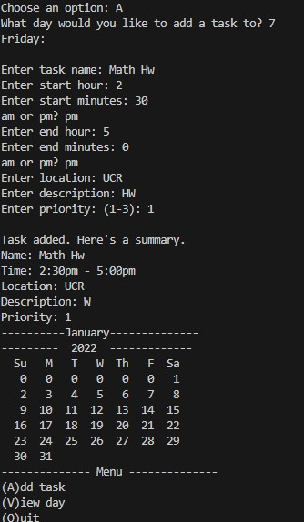
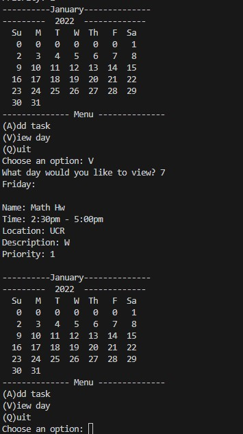
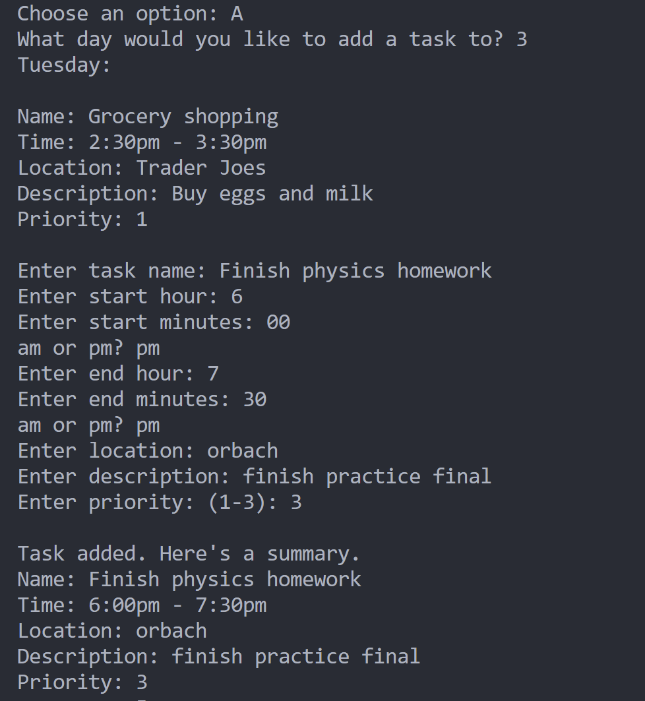
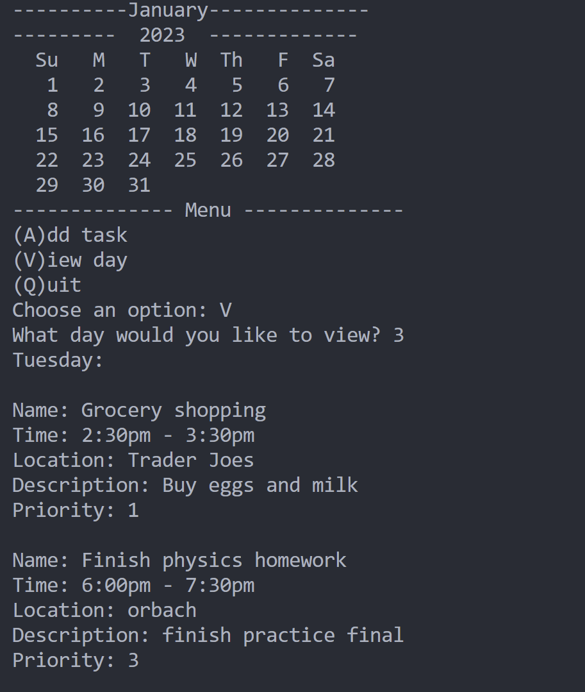

# task manager
 
 Authors: [Nathan Do](https://github.com/NathanTDO)
            [Caleb Mak](https://github.com/cmakkkk)
            [Nathan Wang](https://github.com/Riceko)
            [Jooahn Park](https://github.com/jp8577)         

## Project Description
* Why is it important or interesting to you?

  Time management is a common issue for college students so it is important to have an organized timeline when dealing with school, work, and other life events.

* What languages/tools/technologies do you plan to use? (This list may change over the course of the project)

  We plan to do this project in C++ using github to coordinate and use .txt files to save and import dates and events. Google test will be used to test functions in our classes and valgrind to check memory leaks. 

* What will be the input/output of your project?

  The output of the project will be in a calendar format in the terminal. There will be menu options and the user will be able to select an option where they can input different tasks.

* What are the features that the project provides?

  The ability to see the whole month, how many days have tasks, and how busy the days will be. Tasks will have specific times and dates associated with them to aid in organization.

### Navigation Diagram

The Navigation diagram first portrays a calendar of a specific date provided. Then it is placed in a view screen where the calendar month is shown as well as the tasks on a certain day. From the view screen, the user is allowed to go into an edit screen where they are then given an option to either add a task to the date, delete a task, or edit the task that it currently is on. The diagram represents that you are able to travel backward from each screen depending on what the user wants to do.

## Class Diagram

Through the class diagram, we are able to work from the bottom up as certain classes are utilized in the more general classes. Within the Time class, it is only necessary to have the hour and minute variable to keep track of the time and utilize accessors and mutators to be able to change or access these variables. Within the task class, we utilize the time class to create a start and end time for a certain event, and is utilized more within the methods to access the times. The task class is utilized in the day class through an array that lists the tasks for that day. Finally, the month class utilizes the day class within the array of days that pertain to the number of days in the month.

○ What SOLID principle(s) did you apply?

We applied the Single Responsibilty Principle, where a class should be responsible for one and only one purpose. 

○ How did you apply it? i.e. describe the change.

The print functions for the Day, Month, Calendar, Task, and Time classes were placed into their own Print class in order to split the responsibilities of managing and outputting data. This way, classes were not managing data AND printing that data.  

○ How did this change help you write better code?

It helped minimize confusion around the roles and responsibilities of each class and made our code cleaner and more concise.
 
## Final deliverable
 
 ## Screenshots

Screenshots of the input/output after running your application
 ## Installation/Usage

For a new user, they would have to clone our repository in order to install and run our application using this link https://github.com/cs100/final-project-jpark670-nwang078-cmak012-ndo050. 
After cloning the repository, they would navigate to the folder and run the command "cmake ." and then after run the command "make". After than they would have to execute the main file within the bin folder. After that the application will prompt the user on different options within the task manager. From there, the user can decide on what they would like to do with the task manager.

 ## Testing

This project was tested using the googletest framework and valgrind. Googletest was used to test the output of functions in our classes as well as the contructors. Valgrind was used to test the destructors and to check for any memory leaks and uninitalized variables. 

 
